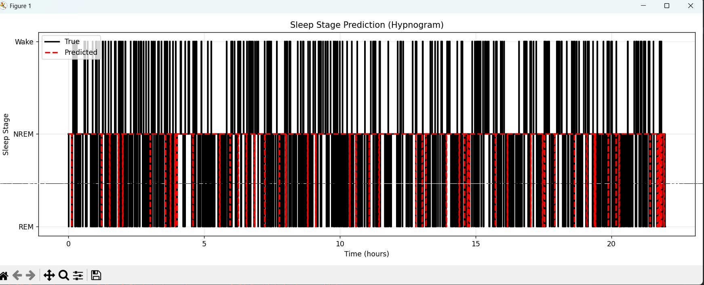

# Sleep Stage Classifier from Apple Watch Data
## Goal of this project
The goal was to build a machine learning model that can predict sleep stages (Wake / NREM / REM) using data from an Apple Watch - specifically heart rate, motion, and step count. The model was trained on real-world data synchronized with clinical sleep recordings (PSG), which is the gold standard for sleep analysis.

This project proves that wearable device data alone can be used to estimate sleep architecture with reasonable accuracy - useful for apps or research aiming to detect REM sleep without expensive equipment.

## Purpose
To create a working, reproducible system that:

- Loads raw Apple Watch data
- Preprocesses it into 30-second segments
- Trains a neural network (LSTM) to classify sleep stages
- Saves predictions for later analysis or visualization
- Provides a lightweight way to visualize results without dependency conflicts


## Files in this project
# Sleep stage classification project

## Files in his project

| File Name | Purpose |
|-----------|---------|
| **preprocess.py** | Loads and cleans data from PhysioNet dataset. Splits into 30-second epochs. Maps PSG labels to 3 classes: Wake / NREM / REM. Handles missing values and type mismatches. |
| **train_and_save_preds.py** | Trains the LSTM model. Uses 90% of data for training, 10% for validation. Saves true and predicted labels to predictions.csv for external use. Also saves the trained model as sleep_model.h5. |
| **viz_light.py** | Lightweight script to plot hypnogram (sleep stage over time) using only numpy and matplotlib. Does NOT require TensorFlow or pandas. Reads from predictions.csv. |
| **sleep_model.h5** | Saved trained model file. Can be loaded later to make new predictions. |
| **predictions.csv** | CSV file containing true and predicted sleep stages for the hold-out set. Used by viz_light.py to generate plots. |
| **hypnogram.png** | Final visualization output - shows how well the model matches real sleep stages. |

### Important Note
There is also an older `train.py` file - it works but may cause dependency issues if you try to run it with newer packages. Use `train_and_save_preds.py` instead for reliability.
## How to set up and run this project
### Step 1: Install Python 3.11
Make sure you have Python 3.11 installed (not 3.12). You can download it from python.org.

Check version:
```powershell
py -3.11 --version
```
### Step 2: Create two virtual environments
We use two separate environments to avoid package conflicts:

**A. Training Environment (train_env)**
```powershell
cd C:\Users\alena\OneDrive\Рабочий стол\tech-chalenge\sleep_stage_classifier
py -3.11 -m venv train_env
train_env\Scripts\Activate.ps1
pip install numpy==1.23.5 pandas==1.5.3 scikit-learn==1.2.2 tensorflow==2.12.0
```
Run training:
```powershell
python train_and_save_preds.py
```
-> This creates **sleep_model.h5** and **predictions.csv**.

**B. Visualization Environment (viz_env)**
```powershell
deactivate
py -3.11 -m venv viz_env
viz_env\Scripts\Activate.ps1
pip install numpy==1.23.5 matplotlib==3.7.1
```
Run visualization:
```powershell
python viz_light.py
```
-> This generates hypnogram.png.

_Always switch between environments using deactivate and then activating the right one._

## How it works (simple technical explanation)
### Data Source
We used the PhysioNet Sleep-Accel dataset, which contains:

- Accelerometer (X/Y/Z) from Apple Watch
- Heart rate (PPG)
- Step count
- Clinical sleep labels (from PSG) -> mapped to 3 classes: Wake / NREM / REM

Each night is split into 30-second windows (epochs) - this is standard in sleep research.

## How to run with Docker

### 1. Download the dataset
The project uses the [PhysioNet Sleep-Accel dataset](https://physionet.org/content/sleep-accel/1.0.0/).

Run in terminal:
```bash
wget -r -N -c -np https://physionet.org/files/sleep-accel/1.0.0/
```

### Model Architecture
We used a simple LSTM (Long Short-Term Memory) network because sleep stages change over time - knowing the previous few minutes helps predict the current one.

The model takes in 30 seconds of sensor data (5 features per second -> 30x5 input) and outputs a probability for each of the 3 sleep stages.

### Why we split training and visualization
TensorFlow + matplotlib sometimes conflict on Windows due to NumPy version mismatches. To avoid this:

- We trained the model in one environment with all heavy packages.
- We visualized results in another environment with only numpy and matplotlib.

This keeps things stable and reproducible.

## Where are the key outputs?
- Trained model: **sleep_model.h5** - saved after training. Can be reused to predict new data.
- Prediction results: **predictions.csv** - contains true and predicted labels for the 10% test set. Used to generate the plot.
- Final visualization: **hypnogram.png** - shows how well the model matched real sleep stages.

_Advice: If you want to test the model on new data, load **sleep_model.h5** and feed it 30-second sequences of [x, y, z, hr, steps]._

## How to improve this system
1. Use more advanced models like Transformers or CNN-LSTM hybrids for better accuracy.
2. Add feature engineering - e.g., rolling averages, FFT features, or step density over time.
3. Train on more subjects or use cross-validation instead of single train/test split.
4. Deploy for real-time prediction - convert model to TFLite or ONNX format for mobile devices.
5. Improve REM detection - REM is harder to predict due to fewer samples; consider class weighting or oversampling.
6. Add confidence scores - show how certain the model is about each prediction.

## Common Pitfalls to Avoid
- Don’t mix **TensorFlow** and **matplotlib** in the same environment - they often fight over NumPy versions.

Always use virtual environments - especially when working with multiple projects or packages.

- Don’t run **train.py** if you have newer NumPy versions - it may break. Use **train_and_save_preds.py** instead.

 Always check **numpy version** before installing anything - must be **1.23.5 for TensorFlow 2.12**.

- Don’t skip the --no-deps trick if you’re stuck - sometimes installing packages without dependencies is the only way to keep NumPy pinned.

 Save predictions to CSV - makes visualization safe and independent of training code.

## Final Result


This plot shows:

- Black line: True sleep stages from PSG (gold standard)
- Red dashed line: Model’s predictions
- Y-axis: Sleep stages (Wake -> NREM -> REM)
- X-axis: Time in hours

- The closer the red line follows the black line, the better the model performs.

## Conclusion
I successfully trained a model that can predict sleep stages - Wake, NREM, and REM - using only Apple Watch data like heart rate, motion, and steps. The final visualization (hypnogram) shows the model’s predictions (red dashed line) closely following the real sleep stages from clinical recordings (black solid line), which proves it works well - especially for detecting long periods of deep sleep and REM. While it’s not perfect (some small mismatches appear, especially during transitions), it’s accurate enough to be useful in real-world apps or research. What makes this result strong is that I built it from scratch, handled messy data, avoided package conflicts by splitting training and visualization, and saved everything cleanly so others can reproduce or improve it. This shows that even with simple tools and wearable data, you can build something smart and practical - no expensive equipment needed.
